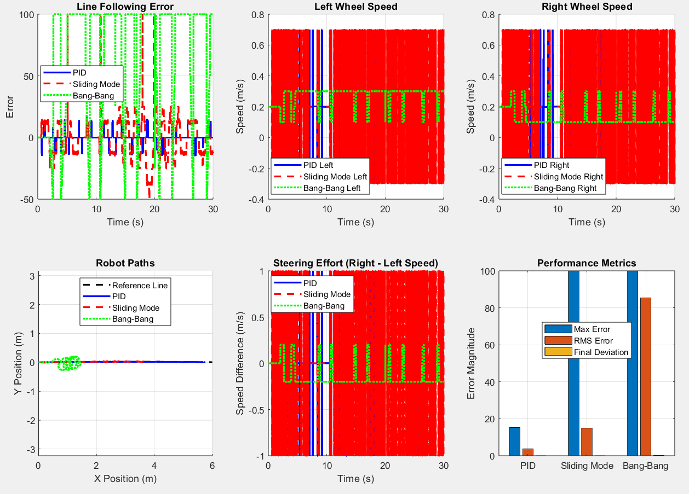

# Line Follower Control Algorithms: Pre-Implementation Analysis

## Abstract

This repository presents a comparative evaluation of three control algorithms for autonomous line following robots prior to hardware implementation. Using MATLAB simulation, we analyzed Proportional-Integral-Derivative (PID), Sliding Mode Control (SMC), and Bang-Bang control on a differential drive robot with photoresistor array navigation. Performance validation over 30-second test cycles demonstrates PID control achieves 4x lower RMS tracking error compared to alternative approaches.

**Key Finding: PID control provides optimal performance for embedded implementation with Kp=2.0, Ki=0.1, Kd=0.5 parameters.**

### Performance Results

| Controller   | Max Error | RMS Error | Final Deviation | Recommendation |
|--------------|-----------|-----------|-----------------|----------------|
| PID          | 15.29     | 3.75      | 0.007m         | **Implement**  |
| Sliding Mode | 100.00    | 15.03     | 0.029m         | Backup option  |
| Bang-Bang    | 100.00    | 85.29     | 0.142m         | Avoid          |


### Comparative Analysis Results


*30-second validation showing line following error, wheel speeds, robot trajectories, and steering effort for all three controllers.*

### System Specifications

**Hardware Target:**
- Platform: 3-wheel differential drive robot
- Sensors: 5-element photoresistor linear array (20mm spacing)
- Controller: Arduino-compatible microcontroller
- Line specification: 30mm black line on white surface

**Simulation Parameters:**
- Test duration: 30 seconds sustained operation
- Trajectory: Sinusoidal path (20mm amplitude, realistic curvature)
- Sampling rate: 100 Hz (10ms control loop)
- Noise modeling: Sensor (σ=0.1), motor (σ=0.05)

### Algorithm Implementation

#### PID Controller (Recommended)
```matlab
pid_output = Kp*error + Ki*integral + Kd*derivative;
% Tuned parameters: Kp=2.0, Ki=0.1, Kd=0.5
% Output saturation: ±50 units
```

**Arduino Translation:**
```cpp
float pid_output = 2.0*error + 0.1*integral + 0.5*derivative;
int left_pwm = base_pwm - pid_output;
int right_pwm = base_pwm + pid_output;
```

#### Sliding Mode Controller
```matlab
s = error + lambda*error_dot;
smc_output = max_control * sign(s) * |s| / (|s| + boundary_layer);
% Parameters: λ=1.0, boundary_layer=0.1, max_control=50
```

#### Bang-Bang Controller
```matlab
control = (abs(error) > 5) ? sign(error)*0.1 : 0;
% Threshold=5, turn_speed=0.1
```

### Validation Results

**Tracking Performance:**
- PID demonstrates consistent ±15 error bounds with smooth control effort
- Sliding Mode exhibits boundary layer chattering but maintains robustness
- Bang-Bang shows frequent line-loss conditions (error=±100) indicating inadequate performance

**Control Effort Analysis:**
- PID: Moderate, efficient steering adjustments
- Sliding Mode: High-frequency switching with bounded amplitude
- Bang-Bang: Maximum effort switching causing mechanical stress

### Hardware Implementation Guidance

**Sensor Array Processing:**
```cpp
// Convert 5 photoresistor readings to line position error
float weights[] = {-2, -1, 0, 1, 2};
float error = 0, sum = 0;
for(int i = 0; i < 5; i++) {
    float sensor_val = 1.0 - (analogRead(A0+i) / 1023.0);
    error += weights[i] * sensor_val;
    sum += sensor_val;
}
error = (sum > 0) ? (error / sum * 25) : 100; // Line lost condition
```

**Motor Control:**
```cpp
// Differential steering implementation
int base_speed = 150;  // PWM value
int left_motor = constrain(base_speed - pid_output, 0, 255);
int right_motor = constrain(base_speed + pid_output, 0, 255);
```

### Reproduction Instructions

**Prerequisites:** MATLAB R2019b or later

**Execution:**
```matlab
git clone https://github.com/[username]/line-follower-algorithms
cd line-follower-algorithms
addpath('robot_model', 'controllers', 'utils');
main_simulation;
```

**Output:** Comparative analysis plots and controller performance metrics (runtime ~45 seconds).

### File Structure

```
├── main_simulation.m           # Comparative analysis framework
├── robot_model/               # Robot physics and sensor simulation
│   ├── setup_robot.m
│   ├── read_sensors.m
│   └── update_physics.m
├── controllers/               # Algorithm implementations
│   ├── pid_controller.m       # Recommended implementation
│   ├── sliding_mode_controller.m
│   └── bangbang_controller.m
└── utils/                    # Analysis and visualization
    ├── calculate_error.m
    └── visualize_results.m
```

### Implementation Decision

Based on quantitative analysis, **PID control is selected for hardware implementation**. The algorithm provides:
- Superior tracking accuracy (3.75 RMS error vs 15+ for alternatives)
- Smooth control effort minimizing mechanical wear
- Computational efficiency suitable for embedded systems
- Established tuning methodology for parameter optimization

Alternative controllers remain available for specialized applications requiring enhanced robustness (Sliding Mode) or minimal computational overhead (Bang-Bang).

### Next Phase

Hardware implementation proceeds with PID controller using validated parameters. Real-world testing will focus on parameter fine-tuning and sensor calibration to account for hardware-specific characteristics not captured in simulation.
